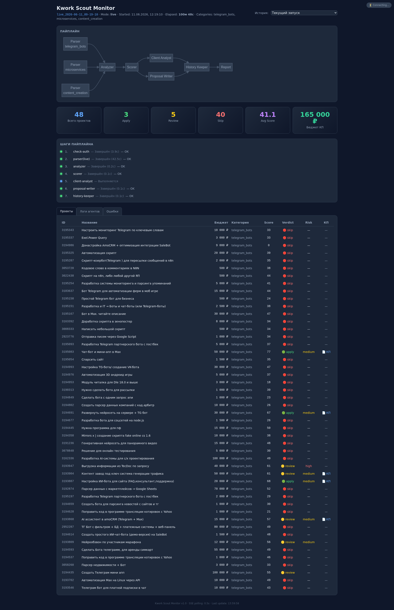
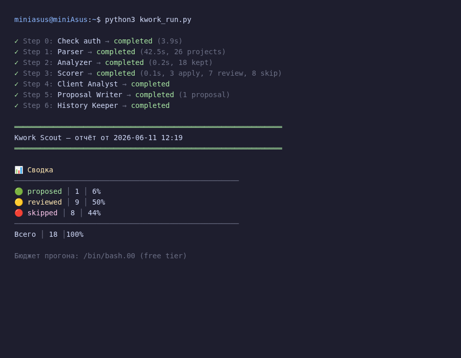
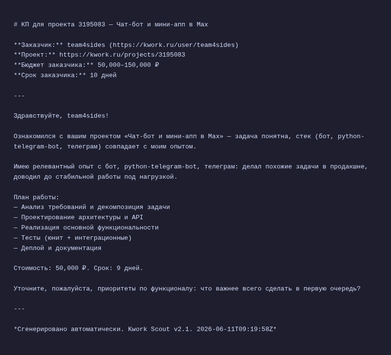

# Kwork Scout v2.1

> **Пайплайн** для автоматизированного поиска, скоринга и формирования откликов на проекты с [kwork.ru](https://kwork.ru).
>
> **Бюджет:** $0.00 — все компоненты работают на free-tier модели.
> **Платформа:** OpenCode.
> **Статус:** ✅ live-парсинг работает, ✅ веб-монитор активен, ✅ авторизация через cookies.

---

## 📋 Описание проекта (структура из урока)

### Проблема

Фрилансеры на kwork.ru тратят **до 2–3 часов в день** на ручной поиск подходящих проектов, фильтрацию по навыкам, оценку заказчиков и написание откликов. Из-за конкуренции многие хорошие проекты уходят к тем, кто успел откликнуться первым. **Постоянный мониторинг вручную — утомителен, отвлекает от работы и снижает продуктивность.**

### Пользователь

Фрилансеры, которые работают на kwork.ru в категориях разработки (telegram_bots, microservices, content_creation) и хотят:
- тратить **15 минут в день** вместо 2–3 часов на поиск проектов;
- не пропускать выгодные заказы;
- получать готовые черновики откликов;
- отсеивать ненадёжных заказчиков автоматически.

### Основная функция

**На входе:** список проектов с kwork.ru (3 категории).  
**Что делает:** парсит → фильтрует по навыкам → скорит по 5 компонентам → оценивает риск заказчика → генерирует КП.  
**На выходе:** таблица проектов с вердиктами (apply / review / skip), готовые коммерческие предложения, отчёт.  

**Ключевые инструменты:** Python, Playwright (парсинг), мультиагентная архитектура на OpenCode.

### Формат результата

Пользователь получает:
1. ✅ **Markdown-отчёт** с таблицей проектов, скорами и вердиктами
2. ✅ **Готовые КП** (файлы `proposals/*.md`) для выбранных проектов
3. ✅ **Веб-дашборд** на `http://localhost:8080` с визуализацией всех этапов
4. ✅ **Историю** (`data/history.json`) и отклонённые проекты (`data/rejected.json`) для анализа

### Минимальный функционал (MVP)

Первая версия реализует:
- Парсинг kwork.ru по 3 категориям с дедупликацией
- Фильтрация по навыкам из YAML-конфига (indicators-driven matching)
- Взвешенный скор 1–100 по 5 компонентам (tech_match, budget_fit, timeline_fit, client_quality, competition)
- Автоматический вердикт: apply → review → skip
- Оценка риска заказчика (low / medium / high)
- Генерация КП с самокоррекцией (≤1500 символов)
- Веб-монитор с SSE-обновлениями в реальном времени

### Технологии

| Технология | Назначение |
|------------|-----------|
| **Python 3.12** | Основной язык |
| **Playwright** | Headless-браузер для парсинга kwork.ru |
| **FastAPI + Uvicorn** | Веб-монитор + SSE |
| **HTMX** | Фронтенд дашборда |
| **OpenCode** | Платформа мультиагентной оркестрации |
| **opencode/nemotron-3-ultra-free** | Единая free-tier LLM для всех агентов |
| **MSS / PIL** | Обработка изображений |
| **YAML** | Конфигурация (навыки, веса, пороги) |

---

## 🖼️ Скриншоты

### Веб-монитор (дашборд)

*Веб-монитор на localhost:8080, показывающий статус всех шагов пайплайна, метрики и таблицу проектов.*

### Терминал — запуск пайплайна

*Пример вывода `python3 kwork_run.py`: отчёт с этапами, сводка по вердиктам, бюджет $0.00.*

### Сгенерированное КП

*Пример коммерческого предложения: обращение к заказчику, цена, срок, стек, вопрос.*

---

## Содержание

- [Архитектура](#архитектура)
- [Быстрый старт](#быстрый-старт)
- [Пайплайн (7 шагов)](#пайплайн-7-шагов)
- [Веб-монитор](#веб-монитор)
- [Конфигурация](#конфигурация)
- [Модели](#модели)
- [Структура файлов](#структура-файлов)
- [Примеры использования](#примеры-использования)
- [Решение проблем](#решение-проблем)
- [Безопасность](#безопасность)

---

## Архитектура

```
Пайплайн (7 шагов):

[0] Check auth  → tools/kwork_check_auth.py  → cookies.txt
[1] Parser      → tools/kwork_live_parse.py   → logs/parser_live.json
[2] Analyzer    → kwork_analyzer.py           → logs/analyzer_*.json
[3] Scorer      → kwork_scorer.py             → logs/scorer_*.json
[4] Client Analyst → kwork_client_analyst.py  → logs/client_analyst_*.json
[5] Proposal Writer → kwork_proposal_writer.py → proposals/*.md
[6] History Keeper → kwork_history_keeper.py  → data/history.json + rejected.json
```

Все шаги выполняются **последовательно**. Каждый шаг — отдельный Python-скрипт.

Мультиагентная оркестрация через OpenCode (см. `opencode.json`):
- **Orchestrator** — координация 6 субагентов (шаги 1–6)
- **Parser, Analyzer, Scorer, Client-Analyst, Proposal-Writer, History-Keeper** — субагенты

---

## Быстрый старт

### 1. Установка

```bash
cd opencode

# Создать виртуальное окружение
python3 -m venv .venv
source .venv/bin/activate

# Установить зависимости
pip install -r requirements.txt
playwright install chromium   # ~150 МБ
```

### 2. Авторизация на kwork.ru

**Первый запуск** — выполнить вход:

```bash
python3 tools/kwork_check_auth.py
```
Откроется Chrome на странице kwork.ru. Введите логин/пароль. После входа cookies сохранятся в `cookies.txt`.

**Последующие запуски** — вход не требуется, скрипт использует сохранённые cookies.

### 3. Запуск пайплайна

```bash
# Полный пайплайн:
python3 kwork_run.py

# С очисткой истории:
python3 kwork_run.py --clear

# С ограничением проектов:
python3 kwork_run.py --max-projects 5
```

### 4. Веб-монитор

```bash
# Терминал 1: запустить монитор
python3 tools/monitor_server.py
# → http://localhost:8080

# Остановить: Ctrl+C в терминале
```

---

## Пайплайн (7 шагов)

### Шаг 0: Check auth (`tools/kwork_check_auth.py`)

- Открывает Chrome на kwork.ru
- Проверяет авторизацию через поиск кнопки «Войти» в DOM
- Если кнопка есть → не авторизован → ждёт ввода логина/пароля
- Если кнопки нет → авторизован → сохраняет cookies
- **Выход:** обновлённый `cookies.txt`

### Шаг 1: Парсер (`tools/kwork_live_parse.py`)

| Режим | Источник данных |
|-------|----------------|
| Live | kwork.ru (3 категории, 3 страницы каждая) через Playwright + cookies.txt |

Парсит все 3 категории в одном браузере, дедуплицирует по `project.id`, сохраняет массив `categories: []`.  
Антибот-защита: `time.sleep(2–3)` между страницами, случайные задержки.

**Выход:** `logs/parser_live.json`.

### Шаг 2: Анализатор (`kwork_analyzer.py`)

- Фильтрует проекты по навыкам (indicators-driven matching из YAML)
- Дедуплицирует
- Вычисляет предварительный скор 1–10
- Проверяет `avoid_keywords` и `avoid_red_flags`

**Выход:** `logs/analyzer_*.json`.

### Шаг 3: Скорер (`kwork_scorer.py`)

Взвешенный скор 1–100 по 5 компонентам:

| Компонент | Вес | Описание |
|-----------|-----|----------|
| tech_match | 0.30 | Соответствие навыкам (indicators-driven) |
| budget_fit | 0.25 | Ставка ₽/ч |
| timeline_fit | 0.10 | Срок выполнения |
| client_quality | 0.25 | Качество заказчика |
| competition | 0.10 | Число откликов |

**Вердикты:**

| Скор | Вердикт | Действие |
|------|---------|----------|
| ≥ 65 | 🟢 **apply** | Генерировать КП |
| 55–64 | 🟡 **review** | Ручное решение |
| < 55 | 🔴 **skip** | Отклонить |

**Выход:** `logs/scorer_*.json`.

### Шаг 4: Клиент-аналитик (`kwork_client_analyst.py`)

Оценивает риск заказчика для проектов с вердиктом `apply` или `review`:

- **low:** hired_percent ≥ 70, есть бейдж «Мощный покупатель» или «Более 3 лет с Kwork»
- **high:** hired_percent < 30 или completed_projects < 3
- **medium:** всё остальное
- **unknown:** нет данных

**Выход:** `logs/client_analyst_*.json`.

### Шаг 5: Писатель КП (`kwork_proposal_writer.py`)

Генерирует коммерческое предложение для проектов с `verdict=apply` и `risk≠high`.

**Требования к КП:**
- 400–1500 символов
- Обращение по имени заказчика
- Цена и срок
- Уточняющий вопрос в конце
- Self-correction: до 2 итераций валидации

**Выход:** `proposals/YYYY-MM-DD_kwork-{id}.md`.

### Шаг 6: Хранитель истории (`kwork_history_keeper.py`)

Атомарная запись: за **один вызов** пишет оба файла:

- `data/history.json` — все обработанные проекты
- `data/rejected.json` — только отклонённые (с причиной)

---

## Веб-монитор

### Запуск

```bash
python3 tools/monitor_server.py
# Остановить: Ctrl+C
```

Открывает `http://localhost:8080` с дашбордом.

### Возможности

| Панель | Описание |
|--------|----------|
| **Pipeline Graph** | Mermaid-диаграмма: 🟢 завершён, 🔵 выполняется, ⚪ ожидает, 🔴 ошибка |
| **Метрики** | Всего проектов, Apply/Review/Skip, Avg Score, Бюджет (∑) |
| **Шаги** | Список с таймингами и статусами |
| **Проекты** | Таблица: ID, Название, Бюджет, Score, Verdict, Risk, КП |
| **Логи** | stdout/stderr |
| **Ошибки** | Список с описаниями |

### API

| Метод | Путь | Описание |
|-------|------|----------|
| GET | `/` | HTML-дашборд |
| GET | `/api/status` | Текущий статус (JSON) |
| GET | `/api/history` | Список последних 8 запусков |
| GET | `/api/runs/{run_id}` | Статус конкретного запуска |
| GET | `/api/proposal/{filename}` | Скачать .md КП |
| GET | `/api/events` | SSE-поток (обновления каждые 0.5с) |

---

## Конфигурация

### `config/freelancer_profile.yaml`

Центральный конфиг. Изменение не требует правки кода.

| Секция | Описание |
|--------|----------|
| `skills` | Навыки по категориям (indicators, tech_stack, adjacent, avoid) |
| `avoid_keywords` | Слова-триггеры для безусловного отклонения |
| `avoid_red_flags` | Жёлтые флаги (проект идёт в review вместо apply) |
| `preferences` | `min_hourly_rate`, `max_project_duration_days` |
| `scoring_weights` | Веса 5 компонентов скора |
| `thresholds` | Пороги apply/review/skip |
| `proposal` | Лимиты КП, стоп-фразы |

**Калибровка:** анализируйте `data/rejected.json`. Если хорошие проекты массово отклоняются — снизьте `min_hourly_rate` или откалибруйте `scoring_weights`.

---

## Модели

Все компоненты используют **единую free-tier модель**. Бюджет прогона: **$0.00**.

| Компонент | Модель | Провайдер |
|-----------|--------|-----------|
| **Все шаги 0–6** | `opencode/nemotron-3-ultra-free` | OpenCode |

---

## Структура файлов

```
opencode/
├── kwork_run.py                     # Единая точка входа
├── kwork_analyzer.py                # Анализ проектов
├── kwork_scorer.py                  # Скоринг
├── kwork_client_analyst.py          # Оценка рисков заказчиков
├── kwork_proposal_writer.py         # Генерация КП
├── kwork_history_keeper.py          # Сохранение истории
├── config/
│   └── freelancer_profile.yaml      # Профиль: навыки, веса, пороги
├── data/
│   ├── history.json                 # Все обработанные проекты
│   └── rejected.json                # Отклонённые (с причинами)
├── proposals/                       # Сгенерированные КП
├── logs/                            # Логи прогонов
│   ├── parser_live.json             # Выход парсера
│   ├── analyzer_*.json
│   ├── scorer_*.json
│   ├── client_analyst_*.json
│   ├── proposal_writer_*.json
│   ├── history_keeper_*.json
│   ├── pipeline_status.json         # Статус для веб-монитора
│   └── runs/                        # История запусков
├── images/
│   ├── dashboard.png                # Скриншот веб-монитора
│   ├── terminal_run.png             # Скриншот терминала
│   └── proposal.png                 # Скриншот КП
├── tools/
│   ├── kwork_live_parse.py          # Парсер (Playwright)
│   ├── kwork_check_auth.py          # Проверка/выполнение входа
│   ├── monitor_server.py            # Веб-монитор (FastAPI + SSE)
│   └── write_status.py              # Утилита записи статуса
├── templates/
│   └── monitor.html                 # HTMX-фронтенд веб-монитора
├── prompts/                         # Системные промпты
├── opencode.json                    # Конфиг агентов
├── CONTRACT.md                      # JSON-контракт v2.1
├── AGENT_SYSTEM_OPENCODE_V2.md      # Дизайн-док
├── AGENTS.md                        # Hard rules
├── requirements.txt
├── cookies.txt                      # Сессионные cookies kwork.ru
└── README.md
```

---

## Примеры использования

```bash
# Запустить полный пайплайн:
python3 kwork_run.py

# Запустить с очисткой истории:
python3 kwork_run.py --clear

# Запустить с ограничением проектов:
python3 kwork_run.py --max-projects 5

# Запустить веб-монитор в отдельном терминале:
python3 tools/monitor_server.py
# → http://localhost:8080
# Остановить: Ctrl+C в терминале монитора
```

---

## Решение проблем

### «cookies.txt не найден» / авторизация не выполнена

```bash
# Запустить вход:
python3 tools/kwork_check_auth.py
# Откроется Chrome, введите логин/пароль
```

### 100% проектов получают skip

Причина: `min_hourly_rate: 500` может быть высок. Снизить порог:
```yaml
# config/freelancer_profile.yaml
preferences:
  min_hourly_rate: 200
```

### Проект отклонился, хотя подходит

Проверьте `data/rejected.json` — там указана причина:
- `low_score` — не хватило скора
- `avoid_keyword:*` — сработало стоп-слово
- `duplicate` — уже в history.json

### Playwright: «DISPLAY не задан»

На headless-сервере без GUI:
```bash
xvfb-run python3 tools/kwork_live_parse.py all
```

---

## Безопасность

1. **`cookies.txt` = сессионный пароль kwork.ru.** Хранить только в корне проекта. В `.gitignore`. Права `chmod 600`.
2. **Никогда не выводить** содержимое `cookies.txt` или `.env` в логи, чаты, отчёты.
3. **Least privilege:** каждый скрипт имеет минимум прав (см. `opencode.json`).

### Проверка

```bash
git check-ignore cookies.txt   # → выводит cookies.txt (если в .gitignore)
ls -la cookies.txt              # → -rw------- (chmod 600)
```

---

## Документация

| Документ | Описание |
|----------|----------|
| [AGENT_SYSTEM_OPENCODE_V2.md](AGENT_SYSTEM_OPENCODE_V2.md) | Полный дизайн-док |
| [CONTRACT.md](CONTRACT.md) | JSON-контракт v2.1 |
| [AGENTS.md](AGENTS.md) | Hard rules и контекст |
| [tools/README.md](tools/README.md) | Документация утилит |

---

*Создано с использованием OpenCode, Playwright, FastAPI, HTMX и opencode/nemotron-3-ultra-free.*
